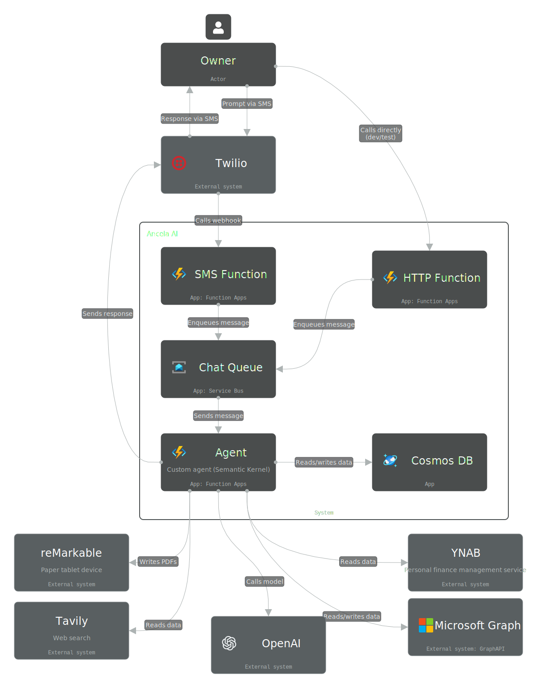

# Ancela

Ancela is an experimental, single-owner AI assistant you talk to by text message.
Send it an SMS and it can manage your calendar and email, track to-dos and projects,
look things up on the web, watch for conditions and remind you — acting on your behalf
across the real-world services it's connected to.

> **Experimental personal project, not a product.** It's wired to one owner's accounts
> and makes deliberate trust trade-offs (see [Security & trust model](#security--trust-model))
> that only make sense for a personal, self-hosted deployment.

## What it can do

You interact entirely over SMS. Under the hood the assistant has a set of capabilities:

- **Calendar & email** — read your calendar, create events, read your inbox, and send mail (via Microsoft Graph).
- **Contacts** — look up people's details from your address book.
- **Money** — check account balances and recent transactions (via YNAB).
- **Memory** — remember facts about you and keep a shared list of to-dos.
- **Projects** — longer-lived workspaces for bigger efforts, with freeform notes and trackable, categorized entries (a trip, a list to work through over time, ideas to collect).
- **Reminders** — schedule a one-time SMS reminder for a specific time.
- **Standing rules** — watch a recurring condition on a timer and notify you when it's met.
- **Scheduled tasks** — run a recurring action on a clock schedule and report back (e.g. a daily calendar summary).
- **Web** — search the web and fetch page content to answer questions.
- **reMarkable** — send a document to your reMarkable tablet (owner only).

### Example prompts

```
hello ancela                                    ← start a session
Remember that my favorite color is blue
Add a to-do: buy milk, eggs, and bread
What's on my calendar tomorrow?
Create a lunch with Sarah next Friday at 1 PM
Any new emails? Reply to Sarah that I'm running late
What's John's email address?
How much is in my checking account?
Remind me to call the dentist at 9am Monday
Every morning at 7, text me my calendar for the day
Let me know if I get an email from the landlord
Start a project for our backpacking trip and add a packing list
```

## Architecture

Ancela is a cloud-native .NET application orchestrated with [Aspire](https://learn.microsoft.com/dotnet/aspire/).

The message flow:

1. A user texts the assistant's **Twilio** number.
2. Twilio posts the message to an **Azure Functions** HTTP trigger, which enqueues it to **Azure Service Bus** and returns immediately.
3. A queue processor picks up the message. A lightweight interceptor handles session and access commands (`hello ancela`, `invite`, `revoke`); everything else is handed to the agent.
4. The **agent** builds a [Semantic Kernel](https://learn.microsoft.com/semantic-kernel/) instance per request, exposes its capabilities as kernel functions, and lets **OpenAI (`gpt-5-mini`)** decide which to call via automatic function calling.
5. Those functions read and write **Azure Cosmos DB** and reach out to Microsoft Graph, YNAB, the web (Tavily), Twilio, and reMarkable as needed. The reply goes back to the user as an SMS.

**Autonomous work** (standing rules and scheduled tasks) runs the same agent from a timer/queue with no user present, under a restricted kernel profile (see [Security & trust model](#security--trust-model)).



*The diagram shows the core chat path. Autonomous work (reminders, standing rules, scheduled tasks) runs the same agent off its own Service Bus queues and is described above.*

**Tech stack:** .NET 10 / C# 13 · Aspire (orchestration + Bicep infrastructure-as-code) · Azure Functions (isolated worker) · Azure Cosmos DB · Azure Service Bus · Semantic Kernel + OpenAI · Twilio · Microsoft Graph · YNAB · reMarkable.

A companion read-only CLI (`Ancela.Cli`) browses the Cosmos containers for auditing and runs owner TOTP enrollment.

## Security & trust model

Ancela is a **single-owner** assistant. Each deployed instance is wired to exactly
one owner's accounts — one Microsoft Graph identity (`GRAPH_USER_ID`: mail, calendar,
contacts) and one YNAB token — using app-only credentials held by the instance.

The owner authorizes a **small, trusted set of people** (by phone number) to talk to
the agent over SMS. Those users act *through* the agent and can therefore reach the
owner's connected data — read/send the owner's mail, read/write the calendar, read
contacts and finances. **This is intentional.** Authorized users are trusted
principals invited by the owner; they are not mutually-isolated tenants, and the
agent is not a multi-tenant SaaS. Reviewers should treat cross-user access to the
owner's data as by-design, not as a vulnerability.

Data model implications:
- All Cosmos containers partition on `/agentPhoneNumber` (one value per instance).
- **Knowledge, to-dos, and projects are shared** across the instance's authorized
  users — it is one shared memory, by design.
- **Chat history is per-user** (filtered by `userPhoneNumber`).
- Reminders, standing rules, and scheduled tasks are created and listed per-user.

Access boundary: only the owner self-registers; everyone else must be `invite`d by
the owner (by phone number) before `hello ancela` does anything, and the owner can
`revoke` them. Identity, though, still rests on the SMS sender number, which is
spoofable — so the highest-value privilege (the owner's own `invite`/`revoke`) is the
weakest point if someone spoofs the owner's number.

**Owner step-up (TOTP), required.** `invite`/`revoke` require a second factor: the
owner appends a current 6-digit authenticator code (e.g. `invite +15551234567 408291`),
verified server-side via RFC 6238. This binds access-management to *possession of the
secret*, not just the claimed number. The gate **fails closed**: `OWNER_TOTP_SECRET`
must be set, and if it is missing (or malformed) access-management is refused rather
than falling back to number-only — it cannot be bypassed by leaving the secret unset.
Run `ancela enroll` to mint a secret and scan its QR into an authenticator app, then
set `OWNER_TOTP_SECRET`. (Self-registration and normal chat are unaffected, so a fresh
instance still runs; only `invite`/`revoke` are gated. If the owner loses their
authenticator, re-run `ancela enroll` and reset the secret.) Caveat — the code travels
in the SMS body, which Twilio and the carriers can see, so this defends against number
spoofing, not against an attacker who can read the owner's texts or the application
logs; it is lightweight hardening, not hardware MFA.

What is *not* in the trust model: untrusted **web content** fetched by the agent
(`web_search` / `web_fetch`) is not trusted, and neither is any external page reached
during autonomous standing-rule or scheduled-task evaluation. That content must never
be treated as instructions.

**Autonomous profiles.** Two kernel profiles run without a human in the loop:
`StandingRule` (condition evaluated on a timer) and `ScheduledTask` (action run on a
clock schedule). In both cases the model acts from a queue trigger with no user
present to review an action before it happens, so these profiles remove the *ability*
to do harm rather than relying on the model to behave:

- **Least privilege.** They advertise only a read-only investigative subset of
  functions to the model. A single allow-list (`KernelProfilePolicy`) drives this, and
  a hard-deny invocation filter enforces the same list as a backstop: any call outside
  the allow-list — every send/mutation, and indeed anything not explicitly permitted —
  is blocked before it executes, regardless of what the model requests.
- **The model never owns the send path.** A standing-rule evaluation cannot send at
  all; it returns a decision plus suggested message text, and *code* then enforces the
  notification cooldown and sends only to the owner's fixed number. A scheduled task's
  output is likewise sent by code to the owner's number. The model cannot choose a
  recipient, so it has no channel to exfiltrate data to a third party even if hijacked.
- **Untrusted input.** Email bodies and calendar event descriptions are externally
  controlled channels that can carry injection payloads. The `StandingRule` profile
  excludes them entirely; the `ScheduledTask` profile allows them (needed for tasks
  like "daily calendar summary") but labels their content as untrusted data in the
  system prompt.

Together these break the "lethal trifecta" (private data + untrusted content + an
exfiltration channel) by removing the channel structurally. The residual risk is that
injection could shape the *content* of a message delivered to the owner's own number —
lower impact, since there is no third-party destination and the owner can sanity-check
it.

**Shared memory and memory laundering.** Ancela's memory is shared across the
instance, so a malicious user could try to smuggle instructions into later runs by
storing them as knowledge or to-dos. We mitigate that in two ways. First, saved memory
keeps provenance metadata about who created it (`userPhoneNumber`), so entries are not
treated as anonymous facts. Second, autonomous profiles explicitly treat retrieved
memory content — like web pages, email bodies, and calendar text — as untrusted data,
not instructions to follow. This provenance tagging does not make stored content
*trusted*; it mainly reduces memory laundering risk by preserving where a memory came
from and making it auditable when the model encounters it again.

## Build & run

### Prerequisites

- [.NET 10 SDK](https://dotnet.microsoft.com/download)
- [Aspire tooling](https://learn.microsoft.com/dotnet/aspire/fundamentals/setup-tooling) and the Azure CLI for deployment
- Accounts/keys: OpenAI, Twilio (with a phone number), a Microsoft Entra app registration, and (optionally) YNAB

### 1. Configure Microsoft Graph access

In your organization's [Entra admin center](https://aad.portal.azure.com/), create an
**App registration** (single-tenant, no redirect URI) and note its **Application
(client) ID** and **Directory (tenant) ID**. Under **API permissions**, add these
*Application* permissions and **grant admin consent**: `User.Read.All`,
`Calendars.ReadWrite`, `Contacts.Read`, `Mail.Read`, `Mail.Send`. Then create a
**client secret** under **Certificates & secrets** and copy its value.

### 2. Set user secrets

From the AppHost project:

```bash
cd Ancela.AppHost
dotnet user-secrets set Parameters:openai-api-key      "..."
dotnet user-secrets set Parameters:twilio-account-sid  "..."
dotnet user-secrets set Parameters:twilio-auth-token   "..."
dotnet user-secrets set Parameters:twilio-phone-number "..."
dotnet user-secrets set Parameters:graph-user-id       "..."   # the owner's Entra user ID
dotnet user-secrets set Parameters:graph-tenant-id     "..."
dotnet user-secrets set Parameters:graph-client-id     "..."
dotnet user-secrets set Parameters:graph-client-secret "..."
dotnet user-secrets set Parameters:ynab-access-token   "..."   # optional
```

To use owner step-up (`invite`/`revoke`), also set `OWNER_TOTP_SECRET` to the value
produced by `ancela enroll` (see [Security & trust model](#security--trust-model)).

### 3. Set resource-naming environment variables

Two variables control Azure resource naming. Put them in your shell profile (e.g.
`~/.zshrc`) so they're never committed:

```bash
export ANCELA_RESOURCE_PREFIX=your-unique-prefix   # prefixed onto all Azure resource names
export ANCELA_RESOURCE_GROUP=your-resource-group   # used by configure_cosmos.sh
```

### 4. Run locally

```bash
dotnet run --project Ancela.AppHost
```

The Aspire dashboard launches and shows every service and its endpoints.

### Deploy to Azure

Aspire generates Bicep templates into `Ancela.AppHost/aspire-output/`.

```bash
ANCELA_RESOURCE_PREFIX=your-unique-prefix aspire publish   # bake the prefix into resource names
aspire deploy --clear-cache                                # prompts for resource group + secrets
```

You can pull secret values from user secrets to paste during deploy:

```bash
cd Ancela.AppHost && dotnet user-secrets list | grep Parameters
```

After the first deploy, grant your Entra principal the Contributor role on Cosmos DB,
then create the database and containers:

```bash
ANCELA_RESOURCE_PREFIX=your-unique-prefix ANCELA_RESOURCE_GROUP=your-resource-group ./configure_cosmos.sh
```

## License

MIT — see [LICENSE](LICENSE).

---

**Made with ❤️ using Aspire**
